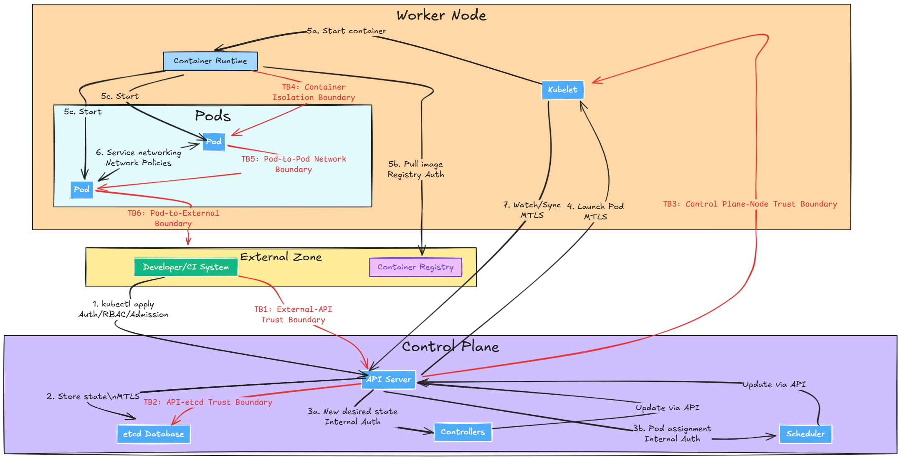

# Kubernetes Trust Boundaries: Mapping Data Flows and Attack Surfaces

Securing Kubernetes is akin to managing a complex, interconnected environment where every component must be safeguarded against potential threats. Just as an organization must clearly define and secure its critical points of interaction, a Kubernetes environment requires precise delineation and protection of its trust boundaries to mitigate vulnerabilities and prevent breaches.

Recent incidents highlight the urgency of clearly defining these boundaries: many Kubernetes breaches stem from misconfigurations, with attackers exploiting unclear or inadequately protected access points. According to industry reports, misconfigurations remain a leading cause of security incidents within Kubernetes environments.

This article provides a comprehensive guide to understanding and strengthening Kubernetes trust boundaries. We will explore the flow of data, identify key attack surfaces with real-world examples, and offer actionable recommendations to bolster your cluster's defenses.

## Background & Key Concepts: Understanding the Landscape

### **- Trust Boundaries:** 

These are the critical lines between different security zones within your Kubernetes cluster. They represent points where the level of trust or control changes between components, networks, or roles. Data flowing across a trust boundary must be scrutinized – authenticated, authorized, and validated – as this is where attackers often probe for weaknesses .

### **- Data Flow:** 

The movement of information within and outside the Kubernetes cluster. Understanding this flow is paramount for identifying vulnerabilities and implementing the right security controls.

### **- Attack Surface:** 

The sum of all potential points where an unauthorized user could attempt to enter or extract data from the environment.

#### **Key security principles are fundamental to securing Kubernetes trust boundaries:**

* **Least Privilege:** Every user, service account, and component should have only the minimum necessary permissions . This limits the "blast radius" of any compromise. For example, a CI/CD pipeline should only have access to deploy to its specific namespace, not the entire cluster .
* **Defense in Depth:** Layer multiple security measures like an onion. An attacker should have to peel through several layers (network policy, authentication, pod security rules) before reaching sensitive assets . If one layer fails, the next provides backup.
* **Zero Trust:** Assume no component or network segment is inherently trusted, even inside the cluster. Authenticate and authorize every request, as if it originated from an untrusted source . This "trust nothing, verify everything" model is often enforced using technologies like service meshes (for mutual TLS and service identity) and network policies .
* **Segmentation:** Isolating workloads, this could be via namespaces or network isolation, for better security management.
* **Auditability:** Ensure logging and monitoring are enabled to identify and detect potential intrusions.
* **Immutability:** Container images and infrastructure should be treated as immutable, with tracked and validated changes.

## In-depth Analysis: Mapping Data Flows & Attack Surfaces

Understanding data flow within a Kubernetes cluster is the first step to identifying trust boundaries and potential attack surfaces. Let's break down a typical operation: deploying an application using `kubectl apply`.

<figure><figcaption>
Data flow and Trust Boundaries - <code>kubectl apply</code>
</figcaption></figure>

### Kubernetes Data Flow: A Step-by-Step Breakdown

1. **User** → **API Server**: A developer or CI system sends a deployment YAML to the Kubernetes API Server. This is a crucial external-to-internal trust boundary. The API Server authenticates the request (via certificate, token, or OIDC) and checks RBAC authorization. Admission controllers may further validate or mutate the request (e.g., applying Pod Security Standards).
2. **API Server → etcd**: If allowed, the API Server writes the new deployment state into etcd, the cluster's state database. This is a highly sensitive trust boundary. etcd should be locked down to the control plane network and use its own authentication (typically certificates), accessible only to the API Server.
3. **API Server → Controllers/Scheduler**: Kubernetes controllers (e.g., the Deployment controller) and the scheduler detect the new desired state and begin creating and assigning Pods to worker nodes. These components are within the control plane's trust zone but still communicate via the API Server's secured interface.
4. **API Server → Kubelet:** The API Server contacts the `kubelet` (the node agent) on the assigned worker node to launch the Pod. This is a trust boundary between the control plane and the node. The kubelet authenticates the API Server's instructions (usually via mutual TLS). Historically, misconfigured kubelet APIs have been significant attack surfaces.
5. **Kubelet → Container Runtime → Pod:** The `kubelet` instructs the container runtime (e.g., Docker, containerd) to pull the image (often from an external registry – another trust boundary) and start the container. The container runtime retrieves the image (which should be from a trusted registry!), and the Pod comes to life. The Pod itself has a trust boundary, enforced by Linux kernel features like `cgroups` and `namespaces`.
6. **Internal Service Networking**: If the Pod needs to communicate with other services, traffic might flow through kube-proxy or a service mesh sidecar. Network policies should control pod-to-pod and pod-to-external communication, enforcing a zero-trust network within the cluster.
7. **API Server → All (Watch/Sync)**: The API Server acts as the central hub, with other components constantly watching and syncing their state. All these interactions must be authenticated.

### Trust Boundaries to Secure

From the data flow above, we can identify several key trust boundaries:

* <mark style="color:red;">**TB1: External Client to API Server:**</mark> The API endpoint is a major entry point and should be protected by authentication, authorization, and often network policies (e.g., limiting access to a VPN or CI system).
* <mark style="color:red;">**TB2: API Server to etcd:**</mark> Only the API Server should access etcd, using strong credentials. etcd should be network-isolated and encrypted at rest.
* <mark style="color:red;">**TB3: Control Plane to Nodes (Kubelet):**</mark> Nodes should only trust instructions from the legitimate API Server. The control plane should also treat nodes as potentially less trusted, especially in multi-tenant or cloud environments.
* <mark style="color:red;">**TB4 Within the Node – Pod to Host:**</mark> This is the container isolation boundary. Linux security features (seccomp, AppArmor/SELinux, rootless containers) strengthen this boundary.
* <mark style="color:red;">**TB5 Pod-to-Pod / Pod-to-External:**</mark> Network boundaries between pods, and between pods and external systems, need strict control. NetworkPolicies or service meshes enforce zero-trust networking.

## Kubernetes Attack Surfaces and Real-World Incidents

Now, let's examine common attack surfaces and real-world incidents that highlight the risks:

<table data-full-width="true"><thead><tr><th width="185">Component / Area</th><th>Attack Surface &#x26; Risks</th><th>Security Measures</th></tr></thead><tbody><tr><td>API Server &#x26; Control Plane</td><td>Publicly exposed API endpoints vulnerable to credential theft or API exploits (e.g., <a href="https://nvd.nist.gov/vuln/detail/cve-2018-1002105">CVE-2018-1002105</a>, which allowed privilege escalation). Exposed the Kubernetes Dashboard can provide easy entry points (as seen in the <a href="https://www.itnews.com.au/news/tesla-left-its-cloud-servers-open-to-cryptomining-hackers-485563">Tesla breach</a>).</td><td>Restrict API access to trusted networks/VPN. Require TLS client authentication. Use RBAC to limit actions even if the API is reached. Regularly patch the control plane.</td></tr><tr><td>etcd</td><td>Exposed or compromised etcd allows attackers to read or alter all cluster state, including secrets.</td><td>Network isolation (accessible only from the API Server). Encryption at rest for Secret data. Client certificate authentication between API Server and etcd.</td></tr><tr><td>Kubelet &#x26; Nodes</td><td>Open kubelet ports can allow remote code execution. The<a href="https://sysdig.com/blog/teamtnt-kubelet-credentials/"> TeamTNT malware</a> campaign (2021) exploited misconfigured kubelets for cryptojacking . Kernel exploits or container escapes (e.g., <a href="https://nvd.nist.gov/vuln/detail/cve-2022-0185">CVE-2022-0185,</a><a href="https://nvd.nist.gov/vuln/detail/cve-2021-32760"> CVE-2021-32760</a>) allow attackers to break out of containers and compromise the node.</td><td>Require authentication on the kubelet API (<code>--anonymous-auth=false</code>). Restrict network access. Keep node OS and container runtime patched. Use minimal distributions (e.g., Bottlerocket, COS) to reduce attack surface. Enforce least privilege for Pods (Pod Security Standards).</td></tr><tr><td>Workloads (Pods)</td><td>Vulnerable applications within pods are entry points. Overly privileged pods (running as root, broad permissions) allow attackers to escalate privileges or misuse service account tokens . Lack of network restrictions enables lateral movement.</td><td>Apply Pod Security Standards (<code>baseline/restricted</code>). Restrict service accounts (least privilege). Disable automount of API tokens when unnecessary. Use NetworkPolicies to limit pod communication (default deny).</td></tr><tr><td>Supply Chain (Images/CI/CD)</td><td>Malicious images or compromised dependencies can infiltrate the cluster . The Argo CD vulnerability (<a href="https://nvd.nist.gov/vuln/detail/cve-2022-24348">CVE-2022-24348</a>) allowed secret exfiltration via a malicious Helm chart . Vulnerable base images or packages create vulnerable workloads.</td><td>Image scanning (Trivy, Anchore, Clair). Image signing (Cosign) and admission control to enforce trusted images. Dependency management tools. Secure CI/CD pipelines (rotate credentials, limit scope). Review and update third-party add-ons regularly . Treat CI/CD systems as high-value targets.</td></tr><tr><td>Human Error</td><td>Misconfigurations and human error are a primary source of security issues.</td><td> Read and apply <a href="https://cloud-native.nikkei.one/">Kubernetes Security Playbook</a></td></tr></tbody></table>

Real-world incidents, beyond those already mentioned, include:

* Argo CD Zero-Day (2022): A path traversal vulnerability ([CVE-2022-24348](https://apiiro.com/blog/malicious-kubernetes-helm-charts-can-be-used-to-steal-sensitive-information-from-argo-cd-deployments/)) allowed attackers to steal sensitive data from Kubernetes applications
* [Cryptojacking Campaigns: ](https://www.wiz.io/blog/dero-cryptojacking-campaign-adapts-to-evade-detection)Groups like Kinsing routinely scan for exposed etcd endpoints, Docker APIs, or kubelets to deploy cryptominers
* [Software Supply Chain Attacks](https://www.sonatype.com/state-of-the-software-supply-chain/introduction): The Sonatype reported a dramatic increase (742% average annual increase over 3 years) in supply chain attacks targeting the pipeline feeding clusters
* Kubernetes Man-in-the-Middle ([CVE-2020-8554](https://nvd.nist.gov/vuln/detail/cve-2020-8554)): A design quirk, combined with overly permissive RBAC, could allow traffic interception in multi-tenant clusters

## Actionable Insights: Practical Steps to Take Now

Here are five practical strategies to immediately improve your Kubernetes security posture:

### 1- Enforce Least-Privilege Access Everywhere:&#x20;

Audit and lock down RBAC roles, service accounts, and cloud IAM roles. No user should have cluster-admin unless absolutely necessary. Use separate accounts for different components. Periodically use kubectl auth can-i --all-namespaces --list or tools like rback or Polaris to flag overly broad permissions . Apply this to node IAM roles as well.

### 2- Segment Your Network and Apply Zero Trust:&#x20;

Implement NetworkPolicies with a default deny ingress policy in each namespace, then whitelist required flows . If using a service mesh, enable peer authentication (mTLS) . Consider segregating sensitive workloads to dedicated namespaces or nodes.

### 3- Harden Pod Configurations and Host Nodes:

* Enable Pod Security Admission with at least the baseline profile cluster-wide . Aim for the restricted profile for production
* Use read-only root filesystems and drop unnecessary Linux capabilities
* Run nodes with a minimal OS and kernel security modules
* Regularly patch Kubernetes, nodes, and images
* Consider enabling audit logging on the API server and auditd on nodes

### 4- Secure Your Software Supply Chain:

* Integrate image scanning into CI
* Use image signing and admission controllers to enforce trusted images
* Use dependency management tools to check for malicious packages
* Protect CI/CD secrets and limit the scope of CI service accounts
* Review and update third-party add-ons regularly

### 5- Use Kubernetes-Focused Security Tools & Automation:

* Run kube-bench to check against the CIS Benchmark
* Periodically run `kube-hunter` (in a safe manner!) to probe for weaknesses \[[link](https://www.aquasec.com/news/introducing-kube-hunter-an-open-source-tool-for-discovering-security-issues-in-kubernetes-clusters/)]
* Employ admission controllers or policy engines for automated policy enforcement
* Implement runtime threat detection

## Conclusion

Securing Kubernetes is an ongoing process, not a project. By systematically mapping and fortifying trust boundaries, you significantly reduce your attack surface and the likelihood of a breach. Key takeaways include, layered security, trust boundaries are security checkpoints and stay informed about vulnerabilities, audit your clusters, and update your threat model .

Start by auditing your current deployments. Identify the trust boundaries and their protections. Are you securing the kubelet? Do you have network policies between critical services? Begin with a baseline audit and implement one or two improvements, such as a default-deny network policy or enforcing non-root containers .

Further your learning by exploring resources like the [CNCF's Cloud Native Security Whitepaper ](https://www.cncf.io/reports/cloud-native-security-whitepaper/)and Kubernetes Security Benchmark reports . By investing in a strong security architecture now, you safeguard your applications and build confidence in your deployments. Secure those trust boundaries, and ship with confidence!

***

Beyond sharing knowledge here, I work directly with teams and organizations as **Nikkei One (n1)**—my solo consultancy focused on turning your cloud-native ambitions into reality. Let’s collaborate to achieve your goals.

📬 **Reach out at** [**contact@nikkei.one**](mailto:contact@nikkei.one) to discuss consulting, hands-on training, or joint projects.\
