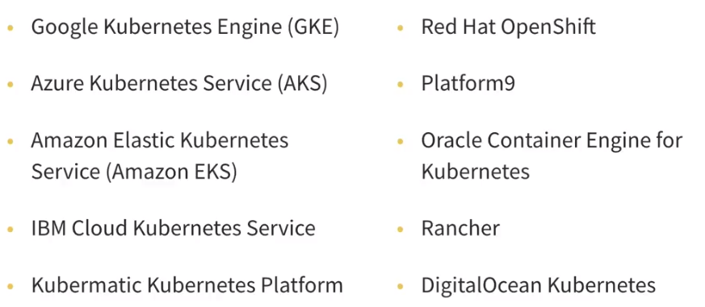

# Tools for Running Kubernetes

### minikube

there are some addons, that henrance features

also you can flag kuberenetes versions

### kubeadm

used to create kubernetes clusters

Automation of cluster creation usgin scrips or tools like Ansible

have some requirents

Need to install container runtime, kubeadm, kubelet, kubectl

config cgroup driver

initialize kubeadm on the master node

copy and save the node join command with token.

install a netwokr plugin of choice

### kOps

This enable us to create, destroy, upgrade and maintain production-grade K8S clusters

the easist way to run a cluster.


[https://kops.sigs.k8s.io/](https://kops.sigs.k8s.io/)


### Managed K8S platforms

<figure><figcaption></figcaption></figure>

Consideration:

* Princing Options
* Security complience
* An easy-to-use interface
* Cloud platform independence
* Built-in authentication and access controls for centralized management
* Provision of high-availability and optimized load-balancing features
* Integrated logging, monitoring, and self-healing options
